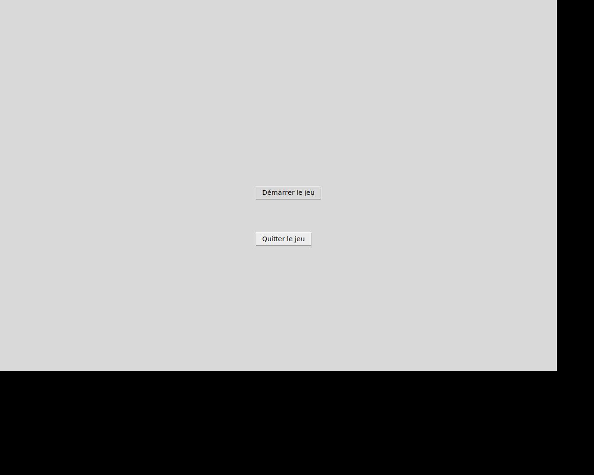

# Pièges! (Stay Alive!) - A Python Board Game



## Overview

This project is a Python implementation of the classic strategy board game **Pièges!** (also known as "Stay Alive!"). It was developed as a group project for a first-year computer science course at Gustave Eiffel University. The game features a graphical user interface and supports two-player gameplay. The objective is to be the last player with marbles remaining on the board.

## Features

*   **Graphical User Interface**: A fully graphical interface built with Tkinter (via a custom wrapper).
*   **2-Player Gameplay**: Play against a friend in this turn-based strategy game.
*   **Interactive Game Board**: Place your marbles and move the sliders with simple mouse clicks.
*   **Dynamic Resizing**: The game window can be resized, and the board will adjust accordingly.
*   **Win Condition Detection**: The game automatically detects when a player has won.

## Technologies Used

*   **Language**: Python 3
*   **GUI Library**: Tkinter (via a custom `fltk.py` wrapper)
*   **Optional**: Pillow (for enhanced image support)

## Installation

To run this game, you need Python 3 and the Tkinter library.

1.  **Clone the repository:**
    ```sh
    git clone <your-repository-url>
    cd Pieges
    ```

2.  **Ensure Python 3 is installed** on your system.

3.  **Install Tkinter:**
    *   On Debian, Ubuntu, or other derivatives, you can install it using `apt`:
        ```sh
        sudo apt-get update && sudo apt-get install python3-tk
        ```
    *   On other systems, Tkinter is often included with Python by default. If it's not, please consult your system's package manager.

4.  **(Optional) Install the Pillow library** for better image handling:
    ```sh
    pip install Pillow
    ```

## How to Play

1.  Navigate to the final version of the project directory:
    ```sh
    cd V3/
    ```

2.  Run the main script to start the game:
    ```sh
    python3 main.py
    ```

3.  The game begins with a preliminary phase where players take turns placing their marbles on the board. Click on an empty, valid slot to place a marble.

4.  After all marbles are placed, the main game begins. Players take turns clicking on the ends of the horizontal or vertical sliders to move them one position.

5.  The goal is to strategically move the sliders to create holes beneath your opponent's marbles, causing them to fall off the board.

6.  The last player with marbles still on the board wins the game!

## Project Evolution

This project was developed incrementally, with each version adding new features:

*   **`V1/`**: A basic, text-based, single-player version of the game engine.
*   **`V2/`**: The first graphical version, introducing the `fltk` library and implementing the full game rules.
*   **`V3/`**: The final version, which refines the gameplay, adds a main menu, and improves the overall structure and user experience.
